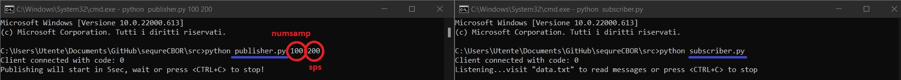

<p align="center">


<div align="center">

## SERIALIZZAZIONE BINARIA E CIFRATURA DI DATI SISMICI IN AMBITO IoT
#### Progetto sviluppato durante il tirocinio per il conseguimento della Laurea in Ingegneria Elettronica presso [UnivPM](https://www.univpm.it/Entra)

</div>

## Introduzione
Questo codice python simula il comportamento di una architettura di rete composta da:

* **Publisher:** sensore che misura i parametri sismici di una struttura e invia i dati alla stazione di monitoraggio
* **Subscriber:** stazione che riceve e analizza i dati

La comunicazione tra i due nodi prevede l'utilizzo di [dati](#dati) formato [CBOR](https://cbor.io) cifrati con chiave simmetrica e inviati attraverso il protocollo MQTT. La descrizione dettagliata di quanto implementato si trova nella Tesi di Laurea.

Per la codifica e la cifratura si è fatto uso della libreria [pycose](https://github.com/TimothyClaeys/pycose), mentre [paho](https://github.com/eclipse/paho.mqtt.python) si occupa della gestione dei client nel protocollo di rete. La scelta del Broker è ricaduta sul servizio online gratuito  offerto da [Mosquitto](http://test.mosquitto.org/).

<a name=dati></a>
## Dati

La struttura dei dati da scambiare è la seguente:

```json
{
   "E" : "str",
   "T" : "int",
   "V" : "list"
}
```
ma questo oggetto JSON viene cifrato e reso irriconoscibile durante la comunicazione. Soltanto il ricevitore autorizzato possiede la chiave per decifrare ed è in grado di risalire al messaggio originale.

## Algoritmo

Questo progetto utilizza l'algoritmo crittografico **AES-GCM** con chiave a **256 bit** per garantire la sicurezza nello scambio dei messaggi. Oltre a garantire la **confidenzialità** dell'informazione, la modalità operativa GCM controlla anche l'**autenticità** e così diventa impossibile per un utente malintenzionato leggere e addirittura modificare i dati per creare falsi allarmi sismici.

## Funzionamento

<p align="center">

  
Come mostrato in figura, per eseguire la simulazione è sufficiente scaricare i due file e lanciare da due diversi terminali i comandi illustrati. A differenza del codice per il **Subscriber**, quello del **Publisher** ha bisogno che gli vengano passati due parametri per poter funzionare:
  
* ***numsamp:*** numero di campioni presenti in ogni pacchetto
* ***sps:*** frequenza con cui vengono presi questi campioni
  
Fatto ciò inizia la pubblicazione sul topic ***data\sensor*** e il ricevitore che è in ascolto legge e salva i dati sul file **data.txt**. Qualora però il pacchetto non sia processabile si è di fronte ad una possibile manomissione e in tal caso si scarta l'informazione e si annota l'evento sul file **log.txt**.

## Test
   
La scelta di **algoritmo** e **chiave** è stata presa sulla base degli output generati [qui](https://github.com/ingtommi/sequreCBOR/blob/main/src/test/scelta.py), mentre [questo](https://github.com/ingtommi/sequreCBOR/blob/main/src/test/confronto.py) ha permesso di valutare i **vantaggi** del protocollo [COSE](https://datatracker.ietf.org/doc/html/rfc8152) sul [JOSE](https://datatracker.ietf.org/doc/html/rfc4627).
